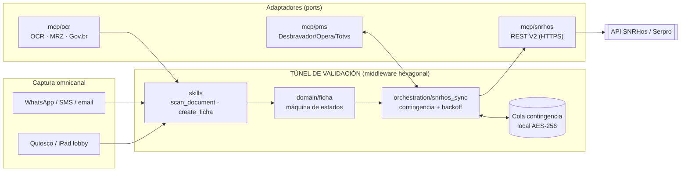

# Túnel FNRH Digital — Arquitectura

Documento técnico del túnel de inscripción de pasajeros. Misma filosofía que el
Access Layer: el sistema **no** se construye alrededor del adaptador externo
(SNRHos), sino alrededor del ciclo de vida de la **Ficha**.

```text
RESERVA  ->  CAPTURA/VALIDACIÓN  ->  FICHA FNRH  ->  SNRHos
(PMS)        (OCR/MRZ + formulario)   (estado local)   (API REST V2)
```

SNRHos se trata como **adaptador de infraestructura** alcanzado por HTTPS. La
lógica de negocio nunca habla con la API directamente: compone el payload JSON y
lo despacha a través del port `SnrhosPort`, igual que el Access Layer compone
comandos RTU y los despacha por el `SmsGatewayPort`.

## Diagrama de componentes



## Máquina de estados de la Ficha

```text
        create_ficha (reserva)
DRAFT ─────────────► CAPTURED ───► PENDING_SYNC ──┬─► REGISTERED ──► CHECKED_OUT
  │                     │              ▲   │       │      │
  │                     │              │   │ 5xx/  │      │ checkout
  │ no-show/cancel      │ cancel       │   │ timeout      │
  ▼                     ▼              │   ▼       │      ▼
CANCELLED ◄─────────────┘         CONTINGENCY ─────┘   (terminal)
  (terminal)                       (cola local) │
                                                │ 4xx (rechazo)
                                                ▼
                                              ERROR ──► PENDING_SYNC (retry)
```

- **5xx / timeout de SNRHos** → `CONTINGENCY`: la ficha se guarda cifrada en cola
  local y la recepción **entrega la llave igual** (la Portaria prohíbe frenar el
  alojamiento por fallos del gobierno). Un job de reintento drena la cola cuando
  Serpro responde.
- **4xx (rechazo de validación)** → `ERROR`: no se reintenta a ciegas; queda para
  revisión/corrección y luego vuelve a `PENDING_SYNC`.
- Transiciones validadas por `assertTransition` (lanza `InvalidTransitionError`).

## Mapeo de eventos del PMS (ciclo de vida)

| Evento PMS | Acción en el túnel | Endpoint SNRHos |
|---|---|---|
| Reserva creada/modificada | `create_ficha` → `DRAFT` + link pre-check-in | Crear/Actualizar Reserva |
| Check-in / walk-in | `snrhos_sync` → `REGISTERED` | Registro de Check-in |
| No-show | `cancel_ficha` → `CANCELLED` | Registro de No-Show |
| Cancelación | `cancel_ficha` → `CANCELLED` | Cancelación de Hospedaje |
| Check-out | `checkout_ficha` → `CHECKED_OUT` | Registro de Check-out |

## Entidades de dominio (espejo de la librería SNRHos)

Las clases `.cs` del documento se mapean a tipos TypeScript en `domain/`:

| Clase SNRHos (`.cs`) | Tipo en `domain/` |
|---|---|
| `Pessoa.cs` | `Pessoa` (identidad y clasificación sociodemográfica) |
| `Documento.cs`, `PessoaDocumento.cs` | `Documento` (RG/CNH/Pasaporte, verificado por OCR) |
| `Hospede.cs`, `Checkin.cs` | `Hospede` + `Ficha.checkin` |
| `Reservas.cs`, `VincularHospede.cs` | `Ficha.reservaLocalizador` + `vincularHospede` |

## Lo difícil: procedencia de los datos (no es leer pasaportes)

Leer pasaportes de cualquier país es la parte **fácil**: la banda **MRZ es ICAO
9303**, un único parser cubre ~190 países. Lo difícil es:

1. **Documentos sin MRZ** — el **RG brasileño** (≈27 layouts estatales) y cédulas
   extranjeras sin banda; OCR de layout libre.
2. **Datos que no están en NINGÚN documento** — y son obligatorios para la FNRH:
   **domicílio** (país/estado/município), **profissão**, **motivo**, **medio de
   transporte**, **procedencia**. Salen del **formulario**, del **PMS** o de
   **Gov.br**, nunca del carnet.
3. **Reconciliación de nombre / transliteración** — MRZ es A–Z sin tildes,
   apellido primero, romanizado ("João"→"JOAO"); casar con la reserva y Gov.br.
4. **Catálogos de dominio cerrado de SNRHos** — motivo/transporte/ciudad deben
   mapear a códigos exactos o el envío se rechaza (4xx).

El código modela esto en `domain/fnrh_requirements.ts`: cada campo declara su
**procedencia** (`FieldSource`: DOCUMENT_MRZ / DOCUMENT_OCR / FORM / PMS / GOVBR),
si es obligatorio y si está o no en el documento. `missingMandatoryFields()`
alimenta un **gate de completitud** en `snrhos_sync`: si falta un campo
off-document, el envío se **bloquea localmente** (evento `FICHA_INCOMPLETE`) en
vez de gastar un round-trip y cosechar un 4xx — el front pide exactamente lo que
falta.

| Campo FNRH | ¿En el documento? | Procedencia |
|---|---|---|
| Nombre, nº doc, nacimiento, nacionalidad | Sí (MRZ/OCR) | Documento / Gov.br |
| **Domicílio** | **No** | Formulario / PMS / Gov.br |
| **Profissão** | **No** | Formulario / PMS / Gov.br |
| Motivo, transporte, origen, destino | No | Formulario / PMS |
| CPF (brasileños) | A veces | OCR / Gov.br |

## Confiabilidad y contingencia

- `withRetry` reutilizado: backoff exponencial 2s/4s/8s/16s configurable.
- La cola de contingencia es idempotente por `reservaLocalizador + documento`, de
  modo que un drenaje repetido no duplica fichas en SNRHos.
- Cada paso agrega eventos a la bitácora (`FICHA_*`, `SNRHOS_SYNC_*`,
  `CONTINGENCY_*`) — base del log inalterable exigido por LGPD.

## Seguridad / LGPD

- **Base legal:** obligación legal/regulatoria (Art. 7 II) — no requiere
  consentimiento para los datos estándar de la FNRH.
- **Menores (Art. 14):** registro por CPF + fecha de nacimiento, o filiación
  vinculada al tutor; datos cifrados y restringidos a roles autorizados.
- **Cifrado:** TLS 1.3 en tránsito, AES-256 en reposo (cola local + API-Key).
- **Accesos:** RBAC + MFA para administradores, log de auditoría append-only.

## Fuera de alcance del esqueleto actual

Adaptadores reales (cliente HTTP SNRHos, SDK OCR/MRZ, OAuth Gov.br, conectores
PMS), persistencia cifrada y la interfaz de quiosco. Todos se enchufan detrás de
los ports ya definidos sin tocar la lógica de negocio.
